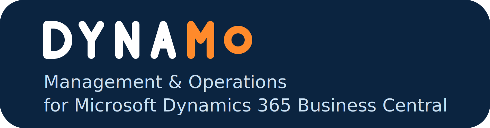

*[English](README.md) · Italiano*

Console di amministrazione per **Microsoft Dynamics 365 Business Central**, locale e online, da
un'unica finestra.

Ogni scheda è un **server** (locale) o un **tenant** (online); le righe sono le **istanze** di
servizio o gli **ambienti**. Da lì si verifica che una destinazione risponda, si avviano e si
fermano i servizi, si pubblicano e si gestiscono le estensioni, si legge e si confronta la
configurazione dei servizi, si vede chi è collegato e si apre il web client sulla company che
serve — su molte destinazioni insieme, con l'esito di ogni operazione conservato in una coda da
leggere con calma.

**[Scarica l'ultima versione](../../releases/latest)** · [Novità](CHANGELOG.it.md) ·
[Licenza](LICENSE.it) · [Dati d'uso](PRIVACY.it.txt)

| | Locale | Online |
|---|---|---|
| Verifica di raggiungibilità | ✔ | ✔ |
| Avvio / Arresto / Riavvio | ✔ | — (non c'è un servizio da comandare) |
| Informazioni e caricamento licenza | ✔ | — (le licenze sono abbonamenti M365) |
| Elenco delle estensioni installate | ✔ | ✔ |
| Installa / disinstalla / annulla pubblicazione | ✔ | ✔ (l'annullamento richiede BC 25.4+) |
| Sincronizzazione dello schema | ✔ | — (lo fa la piattaforma durante il deployment) |
| Pubblicazione (singolo .app o intera cartella) | ✔ | ✔ |
| Lettura e modifica della configurazione | ✔ | — (nessuna API la espone) |
| Operazioni sugli ambienti (copia, ripristino, finestra) | — | ✔ |

---

## Scaricare e installare

Con ogni rilascio vengono pubblicati due pacchetti di installazione. Cambiano **solo la lingua delle
finestre del setup** — l'applicazione installata è la stessa e resta bilingue in entrambi i casi:

    dynamo-<versione>-x64-it.msi    setup in italiano
    dynamo-<versione>-x64-en.msi    setup in inglese

Doppio clic sul file. Il setup mostra il contratto di licenza e chiede di accettarlo, poi chiede tre
cose: la **cartella** di destinazione (`C:\Program Files\Dynamo` per impostazione predefinita),
quali **collegamenti** creare e la **lingua** predefinita. L'installazione è per macchina, quindi i
collegamenti compaiono per tutti gli utenti e servono i diritti di amministratore.

Meglio un percorso di destinazione corto: l'albero dei file arriva già a 102 caratteri da solo, e
oltre i 260 complessivi Windows non riesce più a scrivere.

Il pacchetto **non è firmato**: Windows mostra «Autore sconosciuto» alla richiesta di elevazione.

### Aggiornamento e disinstallazione

Per aggiornare basta eseguire l'installazione della versione nuova: la precedente viene rimossa e
sostituita in un colpo solo, senza disinstallare prima e senza lasciare file vecchi in giro. Per
disinstallare: *Impostazioni di Windows > App > App installate > DYNAMO*.

Eseguendo l'installazione della versione già presente, oppure scegliendo *Modifica* accanto alla
voce in App installate, si apre la pagina di manutenzione con le tre scelte consuete —
**Cambia** (collegamenti e lingua predefinita), **Ripristina** (rimette a posto i file mancanti o
danneggiati) e **Rimuovi**.

Né l'aggiornamento né la disinstallazione perdono elenco, schede, connessioni online o preferenze:
stanno nel profilo utente e non vengono toccate. Per togliere anche quelle si cancella la cartella a
mano.

### Installazione silenziosa

    msiexec /i dynamo-<versione>-x64-it.msi /qn

Le stesse scelte offerte dalle schermate si possono impostare da riga di comando:

    msiexec /i dynamo-<versione>-x64-it.msi /qn ^
            INSTALLFOLDER="D:\Apps\Dynamo" ^
            APPLANGUAGE=it INSTALLDESKTOPSHORTCUT=0 INSTALLSTARTMENUSHORTCUT=1

`APPLANGUAGE` è `it` oppure `en`; le due proprietà dei collegamenti valgono `1` (crea) o `0` (non
creare). Per disinstallare in silenzio, con lo stesso file:
`msiexec /x dynamo-<versione>-x64-it.msi /qn`.

---

## Requisiti

**Sul PC che esegue lo strumento** — niente da installare: il runtime .NET è incluso nel pacchetto.
Windows 10/11, oppure Windows Server 2016 o successivo, x64. Il programma parte con i diritti di
chi lo lancia e **non** chiede conferma a UAC. I diritti di amministratore servono solo per le
istanze Business Central installate su quello stesso computer; dove servono e non ci sono, i comandi
restano spenti e la barra di stato lo dice, quindi niente fallisce a metà lavoro. Con *Strumenti >
Riavvia come amministratore* si riparte con i diritti. Lavorare su server remoti o online non
richiede nulla di tutto questo.

**Sui server Business Central locali** — Windows PowerShell 5.1 con il modulo di amministrazione di
Business Central installato; PowerShell Remoting (WinRM) abilitato, con il loopback consentito per i
servizi sulla stessa macchina; un account autorizzato a gestire i servizi e a pubblicare estensioni.

**Per gli ambienti online** — connettività verso `api.businesscentral.dynamics.com` e
`login.microsoftonline.com`; un browser con cui accedere; un account amministratore di Business
Central sul tenant. Con il modo di accesso predefinito non c'è nulla da preparare in Azure.

---

## Primo avvio — costruire l'elenco

L'elenco parte **vuoto**.

- **Locale**: *Strumenti > Aggiungi server*. Si indica il nome del server e i servizi Business
  Central installati su di esso vengono rilevati e aggiunti alla scheda.
- **Online**: *Strumenti > Aggiungi tenant*. Si indica il dominio del tenant
  (`contoso.onmicrosoft.com`) o il suo identificativo, e dopo l'accesso vengono elencati gli
  ambienti.

L'elenco si salva da solo a ogni modifica. Si può **esportare e importare**, così un collega parte
dal tuo senza riscrivere niente — le tue preferenze non viaggiano mai insieme all'elenco.

### Accedere a un tenant

Due modi, e nessuno dei due tiene un segreto sulla macchina:

- **Accesso con codice — il predefinito.** Il programma mostra un codice; lo si digita nel browser
  all'indirizzo indicato, anche da un altro dispositivo, e si accede con l'account aziendale, MFA
  compresa. L'operazione riprende da sola. **Non richiede alcuna preparazione in Azure**: un tenant
  appena aggiunto funziona subito.
- **Accesso diretto tramite registrazione applicazione.** Il browser si apre subito e l'accesso si
  completa senza codice da digitare. Serve una registrazione applicazione in Microsoft Entra ID, da
  fare una volta sola per organizzazione e con un amministratore del tenant: registrazione di tipo
  *client pubblico/nativo* con `http://localhost` come URI di reindirizzamento, il permesso delegato
  *user_impersonation* su Dynamics 365 Business Central, il consenso amministratore concesso e i
  flussi client pubblico consentiti. Poi si incolla l'ID applicazione (client) nella finestra di
  connessione — è l'unico valore da inserire.

In nessuno dei due casi serve un segreto client. Le impostazioni sono **per tenant**, quindi clienti
diversi possono avere registrazioni diverse e persino cloud diversi, e il token di accesso resta in
una cache cifrata dentro il tuo profilo Windows.

---

## Che cosa si può fare

### Servizi e stato

*Verifica stato* è una prova di **sola lettura**: dice, destinazione per destinazione, se il
servizio risponde e se l'account è autorizzato a lavorarci. È da usare per prima — non cambia nulla.

*Avvia*, *Arresta* e *Riavvia* agiscono su tutte le righe evidenziate; *Riavvia* salta quelle non in
esecuzione. Sulle schede online sono spenti: non c'è un servizio da comandare.

### La destinazione

- **Scheda dei dettagli** — tutto quello che la destinazione dichiara di sé: tipo, stato, versione
  e, per gli ambienti online, il prossimo aggiornamento, il paese, la regione e la geografia, la
  dimensione del database e gli indirizzi web, selezionabili per poterli copiare. Per un'istanza
  locale: il server, l'istanza, il nome del servizio Windows e il percorso del modulo di
  amministrazione effettivamente usato — la prima cosa da guardare quando il modulo non si carica.
  I valori che Business Central non fornisce restano vuoti invece di essere inventati.
- **Apri web client** — apre l'ambiente o l'istanza nel browser predefinito, sulla company che
  scegli, così non compare la selezione company di Business Central. La company scelta l'ultima
  volta su quella destinazione torna selezionata; con una sola company si apre diretto. Su un server
  la domanda arriva solo dove il servizio non dichiara già una company predefinita.
- **Configurazione per VS Code** — produce la configurazione da incollare in `launch.json` per
  sviluppare su quella destinazione, con i valori letti dal servizio. Da *Sessioni attive* si
  ottiene anche la configurazione di tipo attach della sessione evidenziata, pronta all'uso.
- **Elenco company** — nome, nome visualizzato e identificativo delle company, copiabili.
- **Sessioni attive** — chi è collegato, con la possibilità di chiudere una sessione.
- **Informazioni licenza** — legge la licenza Business Central di un'istanza locale e ne carica una
  nuova.

### Estensioni

**Gestione estensioni** legge le estensioni della destinazione corrente e le mostra con nome,
publisher, versione, stato, come sono state pubblicate e identificativo. Si ordina per colonna e si
filtra su tre assi che si combinano: stato, publisher e testo libero. Da lì si sincronizza, si
installa, si disinstalla e si annulla la pubblicazione.

La disinstallazione **non cancella mai i dati**, su nessun tipo di destinazione: il comando che
cancellerebbe le tabelle dell'estensione non è raggiungibile da qui. Sugli ambienti online la
conferma dice prima che cosa dipende dall'estensione e va tolto per primo, e se una versione è già
**pianificata** — cosa che conta, perché la disinstallazione non rimuove una versione pianificata e
l'estensione si reinstallerebbe da sola più tardi.

Solo in locale c'è la colonna **Sync**: un'estensione pubblicata ma non sincronizzata non funziona,
e questo non si vede da nessun'altra parte.

**La pubblicazione** accetta un singolo `.app` o un'intera cartella, e ricava l'ordine dalle
dipendenze dichiarate dentro ogni pacchetto. L'ordine si vede prima di confermare e **si può
cambiare** — spostare un'app prima di una da cui dipende produce un avviso ma non blocca, perché
quella dipendenza potrebbe essere già installata. Ogni app ha una riga sua nella coda, con stato,
durata ed errore, così ci si può alzare dalla scrivania e al ritorno vedere che cosa è passato. Se
un'app fallisce le altre proseguono; vengono saltate solo quelle che dipendevano da lei, perché
fallirebbero comunque.

**Confronto estensioni** mette a confronto le estensioni di due destinazioni — anche di tipo diverso
e su schede diverse — e mostra che cosa cambia.

**App collegate** risponde alla domanda che ci si fa prima di togliere qualcosa: che cosa si rompe
se questa estensione sparisce.

### Ambienti online

Creazione, copia, rinomina e cancellazione di un ambiente; ripristino a un istante nel tempo o dal
cestino; finestra di aggiornamento e pianificazione dell'aggiornamento; e il registro eventi
dell'ambiente — creazione, copia, rinomina, cancellazione, aggiornamenti, installazioni di app.

**Gli aggiornamenti delle app** stanno dentro la gestione estensioni: la colonna *Versione
disponibile* porta la versione a cui si può passare, e si aggiorna subito oppure nella finestra di
aggiornamento dell'ambiente. Le app che vanno aggiornate prima entrano anch'esse in coda, e prima:
la conferma elenca l'intera catena nell'ordine in cui avverrà. Riguarda le app installate dal
marketplace, comprese quelle dei partner; le estensioni per tenant qui non hanno una versione
disponibile — si aggiornano pubblicando il pacchetto nuovo.

### Configurazione del servizio (locale)

Tutte le chiavi di configurazione di un'istanza, raggruppate per ambito e con la descrizione di che
cosa fa ciascuna. Due istanze si possono **confrontare**, mostrando solo le chiavi diverse — il modo
più rapido di scoprire perché un server si comporta diversamente da un altro. Una chiave si può
modificare da qui, dietro una conferma che nomina l'istanza.

---

## La coda delle attività

La griglia in basso è un **paniere**: le operazioni non partono subito, vengono messe in coda, e se
ne possono aggiungere altre mentre la coda lavora. Niente cancella gli esiti dell'operazione
precedente.

C'è una regola sola: **una corsia per destinazione**. Dentro una corsia le attività vanno in
sequenza, nell'ordine in cui le hai chieste; corsie diverse vanno in parallelo. Chiedendo
«estensione X su A», «estensione X su B», «estensione Y su A» e infine «riavvia A», X su A e X su B
partono insieme, Y su A parte quando X su A ha finito, e il riavvio di A viene dopo Y — senza
aspettare B, che è su un'altra corsia.

*Max destinazioni in parallelo* limita le corsie, quindi vale su tutta la coda, e si può cambiare a
coda piena: alzandolo partono subito le destinazioni in attesa, abbassandolo non si interrompe
niente di già avviato.

La **x** in fondo a una riga compare solo sulle righe ancora in attesa e rimuove quella riga
soltanto: un'attività già avviata non viene interrotta, perché fermare una pubblicazione a metà
lascerebbe il servizio in uno stato incerto. Chiudere l'applicazione con la coda piena chiede
conferma — e l'interruzione ferma l'applicazione, non quello che il server ha già avviato.

### Leggere gli esiti

Il testo dello stato è colorato: verde completata, rosso errore, ambra saltata, blu in corso. Un
errore troncato si apre per intero con il pulsante **...**, e il messaggio in fondo alla finestra si
apre in una finestra leggibile facendoci clic.

Quando una pubblicazione su un ambiente online fallisce, il motivo scritto da Business Central viene
riportato **dentro l'attività**, con l'ora e l'identificativo dell'operazione: non c'è altro da
aprire. Due casi non hanno un motivo da riportare — un pacchetto oltre i 50 MB e un ambiente che non
è ancora in grado di dirlo — e l'attività lo dichiara invece di lasciare nel dubbio.

*Verifica stato* produce un rapporto voce per voce: una riga per controllo, con esito e causa, e le
righe fallite in evidenza.

---

## Selezione e conferme

Le righe si scelgono con la **selezione standard di Windows**: clic, Ctrl+clic per aggiungere o
togliere, Maiusc+clic per un intervallo, Ctrl+A per tutte. Non ci sono voci di menu per la
selezione — la fa la griglia, come in qualsiasi altro elenco di Windows. La selezione di ogni scheda
sopravvive al cambio di scheda.

Contano due nozioni: le **righe evidenziate**, su cui agiscono i comandi che accettano più
destinazioni, e la **riga corrente**, l'ultima su cui si è fatto clic, su cui agiscono i comandi che
ne accettano una sola. Con una sola riga evidenziata le due coincidono, ed è il caso normale.

Ogni funzione che agisce su più righe chiede **conferma, dicendo quante e quali destinazioni
verranno toccate**. Le conferme che interrompono un servizio partono da «No».

---

## Dove stanno le impostazioni

| | |
|---|---|
| Elenco, schede e connessioni online | `%APPDATA%\Dynamo\environments.json` |
| Preferenze (lingua, parallelismo, rilettura) | `%APPDATA%\Dynamo\settings.json` |
| Cache del token di accesso (cifrata) | `%LOCALAPPDATA%\Dynamo\` |
| Account dei server locali | Gestione credenziali di Windows, `DYNAMO:<server>` |

*File > Impostazioni* mostra il percorso della cartella e la apre: è quella da copiare per un backup
o per portare la configurazione su un'altra macchina.

Sono **due file di proposito**. L'elenco si esporta e si scambia; le preferenze sono di chi usa la
macchina — così importare l'elenco di un collega non porta via la propria configurazione.

---

## Lingua e impostazioni regionali

L'applicazione parla **inglese o italiano**, si sceglie da *File > Impostazioni*. Il primo avvio
parte dalla lingua di Windows e la scrive nella configurazione; da lì in poi comanda la tua scelta,
non la macchina. Su un Windows che non è né inglese né italiano parte in inglese. Il cambio ha
effetto **al riavvio** — le finestre già costruite non si riscrivono da sole — e la finestra lo dice
quando confermi.

Numeri e date seguono la **lingua scelta**, non quella di Windows: una durata si legge `8,4s` in
italiano e `8.4s` in inglese.

I messaggi che arrivano da Business Central, da PowerShell o da Windows restano nella lingua di chi
li ha prodotti e non vengono tradotti: riscriverli significherebbe inventarli.

---

## Sicurezza e uso prudente

Lo strumento agisce su sistemi di produzione, ed è fatto per renderlo sicuro prima che rapido.

- **I comandi che può eseguire sono un insieme fisso e chiuso.** Non ci si può eseguire niente di
  arbitrario, e ogni valore che passa a Business Central viaggia come parametro, mai come testo
  incollato dentro un comando. L'elenco esatto dei comandi usati è scritto per esteso nella guida
  inclusa nel pacchetto, dove serve come garanzia di che cosa il programma esegue davvero.
- **Ogni operazione distruttiva si conferma per nome.** La conferma dice su quali destinazioni si
  sta per agire, e quelle che interrompono un servizio partono da «No».
- **La verifica di sola lettura non cambia nulla.** È da usare per prima, per controllare
  raggiungibilità e permessi.
- **L'accesso ai tenant online è interattivo**, verso Microsoft Entra ID con un client pubblico:
  nessun segreto resta sulla macchina. Il token sta in una cache cifrata dentro il tuo profilo
  Windows.
- **Gli account dei server locali stanno in Gestione credenziali di Windows**, dove li vedi e li
  cancelli dal Pannello di controllo senza passare dall'applicazione. La casella «Ricorda la
  password» parte **spenta**: salvare la password di un amministratore di produzione dev'essere una
  scelta, non un'impostazione predefinita.

Da leggere prima di agire su un sistema di produzione:

- **Arrestare o riavviare un'istanza di produzione interrompe il servizio** — utenti disconnessi,
  operazioni in corso abortite. Va fatto in una finestra di manutenzione.
- **Pubblicare un'estensione modifica la destinazione.** Va provata prima su un'istanza di test o su
  un ambiente sandbox, mai direttamente in produzione.
- **In locale la modalità ForceSync disinstalla e ripubblica una versione già presente**, e applica
  le modifiche di schema anche quando comportano perdita di dati. Per questo viene chiesta una
  seconda conferma esplicita.
- **Online la modalità di sincronizzazione Force Sync consente modifiche distruttive dello schema**:
  i dati delle tabelle modificate o rimosse possono andare persi in modo irreversibile. Anche qui
  viene chiesta una seconda conferma esplicita.

---

## Dati d'uso

DYNAMO può inviare **conteggi d'uso anonimi**, per sapere quali comandi vengono usati davvero e su
quali versioni di Business Central, e decidere di conseguenza che cosa curare. Nomi di server,
istanze, tenant, database, account, società ed estensioni non escono mai dalla macchina, e nemmeno i
percorsi o il testo dei messaggi d'errore.

Si spegne da *Impostazioni > Privacy*, con effetto immediato. Quello che è in attesa di partire sta
in un file di testo semplice dentro il profilo utente, leggibile col Blocco note e cancellabile in
qualsiasi momento.

L'informativa completa è in **[PRIVACY.it.txt](PRIVACY.it.txt)**, e nella stessa pagina dentro il
programma.

---

## Licenza

Software proprietario, tutti i diritti riservati. Il contratto di licenza con l'utente finale sta in
**[LICENSE.it](LICENSE.it)** ([versione inglese](LICENSE)). Installando o utilizzando il programma
se ne accettano le condizioni.

L'applicazione incorpora componenti di terze parti: i relativi avvisi stanno in
**[THIRD-PARTY-NOTICES.txt](THIRD-PARTY-NOTICES.txt)** e sono mostrati nell'applicazione sotto
*Informazioni > Componenti di terze parti*.

> Microsoft, Dynamics e Business Central sono marchi registrati di Microsoft Corporation.
> DYNAMO non è affiliato né sponsorizzato da Microsoft.

---

## Segnalare un problema

Apri una [segnalazione](../../issues). Per qualsiasi cosa somigli a un problema di sicurezza, leggi
prima [SECURITY.md](SECURITY.md).

Quando segnali, non incollare mai nomi di server, nomi di istanze, identificativi di tenant, nomi
utente o credenziali: una segnalazione è pubblica. Il numero di versione, che cosa hai fatto e che
cosa è successo bastano per cominciare.
