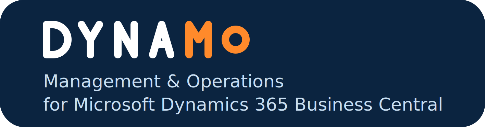
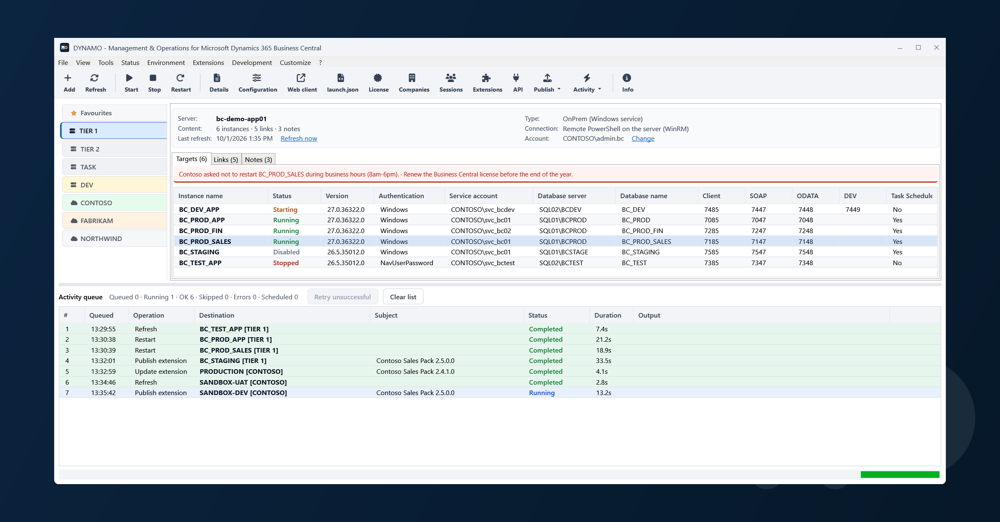
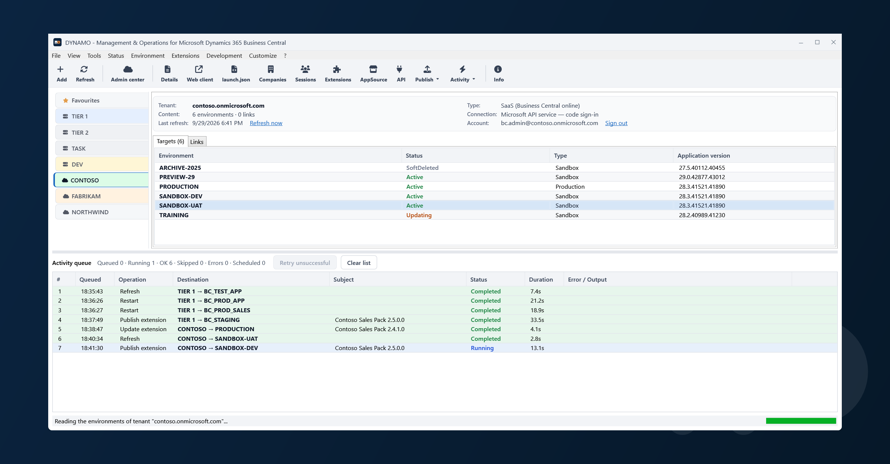
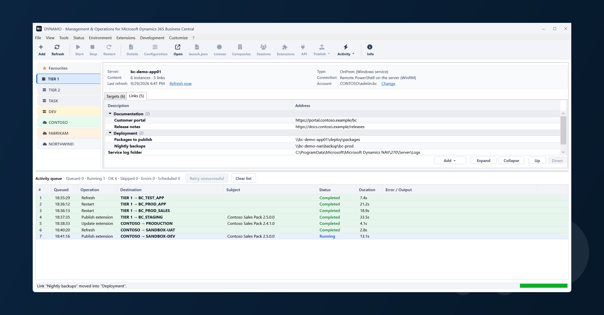

*[English](README.md) · Italiano*

Console di amministrazione per **Microsoft Dynamics 365 Business Central**, locale e online, da
un'unica finestra.

Ogni scheda è un **server** (locale) o un **tenant** (online); le righe sono le **istanze** di
servizio o gli **ambienti**. Da lì si verifica che una destinazione risponda, si avviano e si
fermano i servizi, si pubblicano e si gestiscono le estensioni, si legge e si confronta la
configurazione dei servizi, si vede chi è collegato e si apre il web client sulla company che
serve — su molte destinazioni insieme, con l'esito di ogni operazione conservato in una coda da
leggere con calma.

**[Scarica l'ultima versione](../../releases/latest)** · [Novità](CHANGELOG.it.md) ·
[Licenza](LICENSE.it) · [Dati d'uso](PRIVACY.it.txt)

| | Locale | Online |
|---|---|---|
| Verifica di raggiungibilità | ✔ | ✔ |
| Avvio / Arresto / Riavvio | ✔ | — (non c'è un servizio da comandare) |
| Informazioni e caricamento licenza | ✔ | — (le licenze sono abbonamenti M365) |
| Elenco delle estensioni installate | ✔ | ✔ |
| Installa / disinstalla / annulla pubblicazione | ✔ | ✔ (l'annullamento richiede BC 25.4+) |
| Sincronizzazione dello schema | ✔ | — (lo fa la piattaforma durante il deployment) |
| Pubblicazione (singolo .app o intera cartella) | ✔ | ✔ |
| Lettura e modifica della configurazione | ✔ | — (nessuna API la espone) |
| Operazioni sugli ambienti (copia, ripristino, finestra) | — | ✔ |
| Operazioni pianificate (finestra, prossimo aggiornamento) | — | ✔ |
| Catalogo AppSource (installa e aggiorna app del marketplace) | — | ✔ |
| Cronologia locale delle operazioni lanciate da questo computer | ✔ | ✔ |

*Locale — le istanze di un server, e sotto la coda delle attività.*

*Online — gli ambienti di un tenant, nella stessa finestra e nella stessa coda.*

---

## Perché Dynamo

Chi ha avuto una bicicletta con la dinamo se lo ricorda: quel piccolo cilindro
appoggiato al fianco della ruota, che gira mentre pedali e accende il fanale.
Nessuna batteria, nessuna alimentazione esterna. Solo il movimento che diventa luce.

Dynamo fa la stessa cosa con Business Central. Le istanze ci sono già, i servizi
pure, i tenant anche — ma finché nessuno li avvia, li configura e li tiene sotto
controllo, restano al buio. Dynamo è il pezzo che trasforma il lavoro
dell'amministratore in un ambiente acceso e funzionante.

Da qui viene anche il logo. La parola parte dal bianco neutro di **DYNA** e si
accende sull'arancio di **MO**: è la stessa curva della metafora, dal movimento alla luce. 
E quelle due lettere non sono lì per caso — MO sono le iniziali di Management & Operations, cioè quello
che il prodotto fa davvero.

## Scaricare e installare

Con ogni rilascio vengono pubblicati due pacchetti di installazione. Cambiano **solo la lingua delle
finestre del setup** — l'applicazione installata è la stessa e resta bilingue in entrambi i casi:

    dynamo-<versione>-x64-it.msi    setup in italiano
    dynamo-<versione>-x64-en.msi    setup in inglese

Doppio clic sul file. Il setup mostra il contratto di licenza e chiede di accettarlo, poi chiede tre
cose: la **cartella** di destinazione (`C:\Program Files\Dynamo` per impostazione predefinita),
quali **collegamenti** creare e la **lingua** predefinita. L'installazione è per macchina, quindi i
collegamenti compaiono per tutti gli utenti e servono i diritti di amministratore.

Meglio un percorso di destinazione corto: l'albero dei file arriva già a 102 caratteri da solo, e
oltre i 260 complessivi Windows non riesce più a scrivere.

Il pacchetto **non è firmato**: Windows mostra «Autore sconosciuto» alla richiesta di elevazione.

### Aggiornamento e disinstallazione

Per aggiornare basta eseguire l'installazione della versione nuova: la precedente viene rimossa e
sostituita in un colpo solo, senza disinstallare prima e senza lasciare file vecchi in giro. Per
disinstallare: *Impostazioni di Windows > App > App installate > DYNAMO*.

Eseguendo l'installazione della versione già presente, oppure scegliendo *Modifica* accanto alla
voce in App installate, si apre la pagina di manutenzione con le tre scelte consuete —
**Cambia** (collegamenti e lingua predefinita), **Ripristina** (rimette a posto i file mancanti o
danneggiati) e **Rimuovi**.

Né l'aggiornamento né la disinstallazione perdono elenco, schede, connessioni online o preferenze:
stanno nel profilo utente e non vengono toccate. Per togliere anche quelle si cancella la cartella a
mano.

### Verifica aggiornamenti

DYNAMO può controllare da solo se qui è stata pubblicata una versione più recente, e offrire di
scaricarla e installarla. Il controllo da solo non installa mai nulla — scaricare e installare
richiedono sempre un clic esplicito — e cambia solo l'etichetta di *? > Verifica aggiornamenti*, in
*Aggiornamento disponibile: versione …*. Aprendola si vede cosa è cambiato e, su richiesta, si
scarica l'installer della propria lingua, si verifica contro l'impronta pubblicata insieme a lui e
si avvia; DYNAMO si chiude perché possa sostituire i file in uso, esattamente come lanciando a
mano il nuovo installer.

Se controlla si imposta in *Impostazioni > Aggiornamenti*, «Verifica automaticamente gli
aggiornamenti» — attiva di default, controlla a ogni apertura. Disattivandola resta solo il
controllo a richiesta, la scelta giusta su un server dove le connessioni in uscita sono vietate
per policy.

---

## Requisiti

**Sul PC che esegue lo strumento** — niente da installare: il runtime .NET è incluso nel pacchetto.
Windows 10/11, oppure Windows Server 2016 o successivo, x64. Il programma parte con i diritti di
chi lo lancia e **non** chiede conferma a UAC. I diritti di amministratore servono solo per le
istanze Business Central installate su quello stesso computer; dove servono e non ci sono, i comandi
restano spenti e la barra di stato lo dice, quindi niente fallisce a metà lavoro. Con *Strumenti >
Riavvia come amministratore* si riparte con i diritti. Lavorare su server remoti o online non
richiede nulla di tutto questo.

**Sui server Business Central locali** — Windows PowerShell 5.1 con il modulo di amministrazione di
Business Central installato; PowerShell Remoting (WinRM) abilitato, con il loopback consentito per i
servizi sulla stessa macchina; un account autorizzato a gestire i servizi e a pubblicare estensioni.
Si usa la porta standard di WinRM; un server che accetta solo HTTPS si imposta per scheda, da
*Impostazioni di connessione*.

**Per gli ambienti online** — connettività verso `api.businesscentral.dynamics.com` e
`login.microsoftonline.com`; un browser con cui accedere; un account amministratore di Business
Central sul tenant. Con il modo di accesso predefinito non c'è nulla da preparare in Azure.

---

## Primo avvio — costruire l'elenco

L'elenco parte **vuoto**. Se Business Central è installato sul computer stesso, invece, si parte
dalla scheda **localhost** con le istanze trovate, e a ogni avvio la scheda si allinea da sola a
quelle installate.

Le schede si creano da *Strumenti > Aggiungi scheda*, o dal primo pulsante della barra: si scrive
l'etichetta e si sceglie il tipo.

- **Locale**: si indica il nome del server e i servizi Business Central installati su di esso
  vengono rilevati e aggiunti alla scheda. La scheda resta anche se non si trova niente: il server
  può essere semplicemente spento.
- **Online**: si indica il dominio del tenant (`contoso.onmicrosoft.com`) o il suo identificativo, e
  dopo l'accesso vengono elencati gli ambienti.
- **Nessuno**: una scheda senza destinazioni, fatta di soli collegamenti.

L'elenco si salva da solo a ogni modifica. Si può **esportare e importare**, così un collega parte
dal tuo senza riscrivere niente — le tue preferenze non viaggiano mai insieme all'elenco.

### Accedere a un tenant

Due modi, e nessuno dei due tiene un segreto sulla macchina:

- **Accesso con codice — il predefinito.** Il programma mostra un codice; lo si digita nel browser
  all'indirizzo indicato, anche da un altro dispositivo, e si accede con l'account aziendale, MFA
  compresa. L'operazione riprende da sola. **Non richiede alcuna preparazione in Azure**: un tenant
  appena aggiunto funziona subito.
- **Accesso diretto tramite registrazione applicazione.** Il browser si apre subito e l'accesso si
  completa senza codice da digitare. Serve una registrazione applicazione in Microsoft Entra ID, da
  fare una volta sola per organizzazione e con un amministratore del tenant: registrazione di tipo
  *client pubblico/nativo* con `http://localhost` come URI di reindirizzamento, il permesso delegato
  *user_impersonation* su Dynamics 365 Business Central, il consenso amministratore concesso e i
  flussi client pubblico consentiti. Poi si incolla l'ID applicazione (client) nella finestra di
  connessione — è l'unico valore da inserire.

In nessuno dei due casi serve un segreto client. Le impostazioni sono **per tenant**, quindi clienti
diversi possono avere registrazioni diverse e persino cloud diversi, e il token di accesso resta in
una cache cifrata dentro il tuo profilo Windows.

---

## Che cosa si può fare

### Servizi e stato

*Verifica stato* è una prova di **sola lettura**: dice, destinazione per destinazione, se il
servizio risponde e se l'account è autorizzato a lavorarci. È da usare per prima — non cambia nulla.

*Avvia*, *Arresta* e *Riavvia* agiscono su tutte le righe evidenziate; *Riavvia* salta quelle non in
esecuzione. Sulle schede online sono spenti: non c'è un servizio da comandare.

### La destinazione

- **Scheda dei dettagli** — tutto quello che la destinazione dichiara di sé: tipo, stato, versione
  e, per gli ambienti online, il prossimo aggiornamento, il paese, la regione e la geografia, la
  dimensione del database e gli indirizzi web, selezionabili per poterli copiare. Per un'istanza
  locale: il server, l'istanza, il nome del servizio Windows e il percorso del modulo di
  amministrazione effettivamente usato — la prima cosa da guardare quando il modulo non si carica.
  I valori che Business Central non fornisce restano vuoti invece di essere inventati. Accanto alla
  versione di Business Central, **Novità della …** apre la pagina che Microsoft pubblica per
  quell'aggiornamento — e lo stesso accanto alla versione a cui un ambiente sta per passare, così le
  novità si leggono *prima* di aggiornare. Il collegamento compare solo dove la pagina esiste.
  La scheda dice anche come sta la destinazione adesso: quante sessioni sono aperte e, per un
  ambiente online, quali estensioni ci si stanno distribuendo. Entrambe si cliccano e aprono
  l'elenco completo o il registro eventi. Se un valore non si legge la riga dice *non disponibile*
  e perché: non mostra mai zero.
- **Apri web client** — apre l'ambiente o l'istanza nel browser predefinito, sulla company che
  scegli, così non compare la selezione company di Business Central. La company scelta l'ultima
  volta su quella destinazione torna selezionata, in cima all'elenco con la stella; con una sola
  company si apre diretto. Su un server
  la domanda arriva solo dove il servizio non dichiara già una company predefinita.
- **Configurazione per VS Code** — produce la configurazione da incollare in `launch.json` per
  sviluppare su quella destinazione, con i valori letti dal servizio. Da *Sessioni attive* si
  ottiene anche la configurazione di tipo attach della sessione evidenziata, pronta all'uso.
- **Elenco company** — nome, nome visualizzato e identificativo delle company, copiabili.
- **Sessioni attive** — chi è collegato, con la possibilità di chiudere una sessione.
- **Informazioni licenza** — legge la licenza Business Central di un'istanza locale e ne carica una
  nuova.

### Estensioni

**Gestione estensioni** legge le estensioni della destinazione corrente e le mostra con nome,
publisher, versione, stato, come sono state pubblicate e identificativo. Si ordina per colonna e si
filtra su tre assi che si combinano: stato, publisher e testo libero. Da lì si sincronizza, si
installa, si disinstalla e si annulla la pubblicazione. In locale si lancia anche l'**aggiornamento dei
dati** di una versione nuova già pubblicata, sulle estensioni che lo richiedono — sincronizzandola prima
quando serve.

La disinstallazione **non cancella mai i dati**, su nessun tipo di destinazione: il comando che
cancellerebbe le tabelle dell'estensione non è raggiungibile da qui. Sugli ambienti online la
conferma dice prima che cosa dipende dall'estensione e va tolto per primo, e se una versione è già
**pianificata** — cosa che conta, perché la disinstallazione non rimuove una versione pianificata e
l'estensione si reinstallerebbe da sola più tardi. La disinstallazione si chiede sempre per adesso;
l'ambiente può comunque rimandarla al proprio aggiornamento, e in quel caso la riga della coda esce
**Programmata** e lo dice.

Solo in locale ci sono le colonne **Sync** e **Aggiornamento dati**: un'estensione pubblicata ma non
sincronizzata non funziona, e questo non si vede da nessun'altra parte; la seconda segna la versione
che aspetta l'aggiornamento dei dati — anche quando sono i dati a essere indietro rispetto al
pacchetto, cosa che la colonna **Versione dati** mostra: la versione a cui sono i dati
dell'estensione sul tenant.

**La pubblicazione** accetta un singolo `.app` o un'intera cartella, e ricava l'ordine dalle
dipendenze dichiarate dentro ogni pacchetto. L'ordine si vede prima di confermare e **si può
cambiare** — spostare un'app prima di una da cui dipende produce un avviso ma non blocca, perché
quella dipendenza potrebbe essere già installata. Ogni app ha una riga sua nella coda, con stato,
durata ed errore, così ci si può alzare dalla scrivania e al ritorno vedere che cosa è passato. Se
un'app fallisce le altre proseguono; vengono saltate solo quelle che dipendevano da lei, perché
fallirebbero comunque.

Online l'installazione può anche attendere la **finestra di aggiornamento** dell'ambiente, oppure il
suo prossimo aggiornamento minore o maggiore. Un ambiente senza finestra di aggiornamento rifiuta la
prima scelta, e non riceve nulla.

In locale, quando Business Central richiede l'aggiornamento dei dati per la versione nuova — anche se
la precedente è disinstallata ma i suoi dati ci sono ancora — la pubblicazione lo esegue e installa
l'estensione. Nel dialog si può togliere la spunta: il pacchetto viene allora pubblicato e
sincronizzato, e l'aggiornamento si lancia dopo da Gestione estensioni.

**Confronto estensioni** mette a confronto le estensioni di due destinazioni — anche di tipo diverso
e su schede diverse — e mostra che cosa cambia.

**App collegate** risponde alla domanda che ci si fa prima di togliere qualcosa: che cosa si rompe
se questa estensione sparisce.

### Ambienti online

Creazione, copia, rinomina e cancellazione di un ambiente; ripristino a un istante nel tempo o dal
cestino; finestra di aggiornamento e pianificazione dell'aggiornamento; e il registro eventi
dell'ambiente — creazione, copia, rinomina, cancellazione, aggiornamenti, installazioni di app. Il
registro racconta tutta la storia, non solo ciò che è passato dall'interfaccia di amministrazione:
ci sono anche le distribuzioni fatte da Visual Studio Code e da dentro Business Central, in ordine
di data, e una colonna **Origine** dice da dove viene ogni riga — quelle registrate da Business
Central non dicono chi le ha avviate, quando sono finite né perché sono fallite.

**Operazioni pianificate** elenca ciò che partirà più tardi da solo — le estensioni per tenant in
attesa della finestra di aggiornamento o del prossimo aggiornamento, gli aggiornamenti di app
mandati nella finestra, il prossimo aggiornamento dell'ambiente — e annulla ciò che Business Central
consente di annullare.

**Gli aggiornamenti delle app** stanno dentro la gestione estensioni: la colonna *Versione
disponibile* porta la versione a cui si può passare, e la colonna *Stato* dice **Da aggiornare**, in
ambra, al posto di *Installata*: ordinando per stato le app da aggiornare finiscono insieme. Si
aggiorna subito oppure nella finestra di aggiornamento dell'ambiente. Le app che vanno aggiornate prima entrano anch'esse in coda, e prima:
la conferma elenca l'intera catena nell'ordine in cui avverrà. Riguarda le app installate dal
marketplace, comprese quelle dei partner; le estensioni per tenant qui non hanno una versione
disponibile — si aggiornano pubblicando il pacchetto nuovo. Quando una versione nuova di
un'estensione per tenant è già pianificata, la sua riga dice **Aggiornamento pianificato**, mostra
quella versione, e **Annulla pianificazione** la toglie.

**Il Catalogo AppSource** si apre già pieno: tutte le app per Business Central pubblicate per il
mercato dell'ambiente evidenziato, in ordine alfabetico, che si filtrano scrivendo parte del nome
dell'app o di quello dell'editore — con un clic su Microsoft o sugli editori di cui l'ambiente ha già
delle app. Ogni riga dice chi la pubblica, la versione installata, la versione disponibile — quella
che arriverebbe premendo il pulsante — e se l'app è installata, non installata o da aggiornare. Di
quella evidenziata si legge quello che il marketplace ne dice: a cosa serve, com'è messa a prezzo, la
valutazione, le categorie e i collegamenti a condizioni di licenza, informativa sulla privacy e
supporto; con un doppio clic si apre la pagina dell'editore. La finestra dice quante app sono, per
quale mercato e a che ora l'elenco è stato letto, e *Aggiorna elenco* lo rilegge. Le app per cui
l'editore chiede di essere contattato prima restano in elenco, ma da qui non si installano.

**Installa** chiede una conferma che nomina l'estensione e l'ambiente, mostra le condizioni
dell'editore e l'informativa sulla privacy, e resta spento finché non si spunta di averle accettate.
Installare non è acquistare: la licenza resta una questione fra il cliente e l'editore. Sulle app che
hanno già un aggiornamento lo stesso pulsante diventa **Aggiorna**, e porta alla versione che
*l'ambiente* offre, che può essere indietro rispetto all'ultima pubblicata. Entrambi passano dalla
coda delle attività come ogni altra operazione sulle estensioni, e possono attendere la finestra di
aggiornamento dell'ambiente.

### Configurazione del servizio (locale)

Tutte le chiavi di configurazione di un'istanza, raggruppate per ambito e con la descrizione di che
cosa fa ciascuna. Due istanze si possono **confrontare**, mostrando solo le chiavi diverse — il modo
più rapido di scoprire perché un server si comporta diversamente da un altro. Una chiave si può
modificare da qui, dietro una conferma che nomina l'istanza.

### Collegamenti della scheda

Accanto alla linguetta delle destinazioni, ogni scheda ne ha una con i suoi **collegamenti**:
descrizione e indirizzo di un sito, di una cartella locale o di una condivisione di rete. Servono a tenere accanto alla
destinazione le cose che la riguardano — il portale del cliente, la documentazione, la cartella dei
pacchetti. Si aggiungono, si modificano, si riordinano e si aprono con un doppio clic; viaggiano con
l'elenco esportato, così chi lo riceve trova anche quelli. Un collegamento che punta a un programma o
a uno script chiede conferma prima di avviarlo, nominando il file.

I collegamenti si possono raccogliere in **gruppi**, creati dallo stesso pulsante *Aggiungi*, così una
scheda con venti voci resta leggibile. Un collegamento entra in un gruppo trascinandocelo sopra o dal
menu del tasto destro, un gruppo si apre e si chiude con il triangolino, ed eliminare un gruppo non
elimina i collegamenti che contiene. Anche i gruppi viaggiano con l'elenco esportato.

### Sviluppo

**Scarica simboli Microsoft** prende dai feed pubblici i pacchetti di simboli AL di Microsoft, senza
destinazione e senza accesso: si scelgono localizzazione e versione di Business Central, e arrivano
il set base — System, System Application, Business Foundation, Base Application, Application — più le
altre app Microsoft spuntate.

**Scarica simboli**, in gestione estensioni, prende i simboli dell'estensione evidenziata alla
versione installata su quella destinazione e, a richiesta, le sue dipendenze. Arrivano dai feed
pubblici, per le app Microsoft e AppSource, oppure **direttamente dalla destinazione** attraverso i
suoi servizi di sviluppo, come fa VS Code — per-tenant extension comprese; online funziona sulle
sandbox, non sugli ambienti Production.

**Servizi web e API** mostra che cosa una destinazione pubblica verso l'esterno, e legge soltanto:
ogni servizio con il protocollo su cui risponde — OData V4, API, SOAP — e l'indirizzo a cui si
chiama, già completo della company. Per ogni servizio i campi con tipo, lunghezza e chiave, e i
metodi con i parametri nell'ordine in cui vanno passati e il valore restituito; sui servizi SOAP i
parametri che la procedure modifica sono marcati come tali. Altre tre schede — **Payload**,
**Risposta** ed **Errore** — contengono gli esempi che servono a un documento tecnico: cosa si manda,
cosa torna e com'è fatto un errore, pronti da incollare nel documento o in Postman. Compaiono anche le
API che le app installate pubblicano su un indirizzo proprio, e ogni elenco si copia intero, con le
intestazioni di colonna, in un foglio di calcolo.

---

## La coda delle attività

La griglia in basso è un **paniere**: le operazioni non partono subito, vengono messe in coda, e se
ne possono aggiungere altre mentre la coda lavora. Niente cancella gli esiti dell'operazione
precedente.

C'è una regola sola: **una corsia per destinazione**. Dentro una corsia le attività vanno in
sequenza, nell'ordine in cui le hai chieste; corsie diverse vanno in parallelo. Chiedendo
«estensione X su A», «estensione X su B», «estensione Y su A» e infine «riavvia A», X su A e X su B
partono insieme, Y su A parte quando X su A ha finito, e il riavvio di A viene dopo Y — senza
aspettare B, che è su un'altra corsia.

*Max destinazioni in parallelo* limita le corsie, quindi vale su tutta la coda, e si può cambiare a
coda piena: alzandolo partono subito le destinazioni in attesa, abbassandolo non si interrompe
niente di già avviato.

La **x** in fondo a una riga compare solo sulle righe ancora in attesa e rimuove quella riga
soltanto: un'attività già avviata non viene interrotta, perché fermare una pubblicazione a metà
lascerebbe il servizio in uno stato incerto. Chiudere l'applicazione con la coda piena chiede
conferma — e l'interruzione ferma l'applicazione, non quello che il server ha già avviato.

### Leggere gli esiti

Il testo dello stato è colorato: verde completata, rosso errore, ambra saltata, blu in corso, viola
programmata. **Programmata** è ciò che l'ambiente ha accettato ma non ha ancora eseguito — una
pubblicazione mandata nella finestra di aggiornamento o a una versione futura — a differenza di
*Saltata*, che non si farà. Un errore troncato si apre per intero con il pulsante **...**, e il
messaggio in fondo alla finestra si apre in una finestra leggibile facendoci clic.

Quando una pubblicazione su un ambiente online fallisce, il motivo scritto da Business Central viene
riportato **dentro l'attività**, con l'ora e l'identificativo dell'operazione: non c'è altro da
aprire. Due casi non hanno un motivo da riportare — un pacchetto oltre i 50 MB e un ambiente che non
è ancora in grado di dirlo — e l'attività lo dichiara invece di lasciare nel dubbio.

*Verifica stato* produce un rapporto voce per voce: una riga per controllo, con esito e causa, e le
righe fallite in evidenza.

### Aspettare che la destinazione sia pronta

Prima di un'operazione su un'estensione — pubblicazione, installazione, disinstallazione, annullamento
della pubblicazione, sincronizzazione, aggiornamento dei dati, aggiornamento — DYNAMO controlla tre
cose: che l'ambiente online non sia in preparazione, in aggiornamento o in eliminazione; che non ci
sia già un'altra distribuzione in corso, anche avviata da un collega, da VS Code o da dentro Business
Central; e, su un server, che il servizio dell'istanza sia in esecuzione. Se qualcosa non torna, la
riga resta *In coda* con il motivo e i secondi che mancano al prossimo controllo, e l'operazione parte
da sola appena la strada è libera. Intanto il lavoro sulle altre destinazioni continua a partire.
Avvio, arresto e riavvio dei servizi non vengono mai trattenuti.

Dopo mezz'ora di attesa la riga si chiude *Saltata*, con il motivo scritto, e niente è stato toccato.
Una distribuzione che Business Central ha lasciato appesa — non chiude mai quelle interrotte — non
viene più attesa dopo quattro ore; il limite si imposta da *Strumenti > Impostazioni > Esecuzione*,
«Smetti di attendere una distribuzione dopo (ore)», e con 0 si attende sempre.

Quando a essere in attesa è la riga sbagliata, **Avvia adesso**, il pulsante in fondo alla riga,
scavalca l'attesa. La conferma nomina la destinazione e ripete il motivo, perché se la destinazione è
davvero occupata Business Central può rifiutare l'operazione.

### Riprovare una riga

Una riga che non ha fatto il suo lavoro si può riprovare dalla coda, e riparte con le stesse opzioni
con cui era partita — modalità di sincronizzazione, togli le versioni precedenti, elimina i file dopo,
eliminazione dei dati — senza ripassare dal menu. Il pulsante compare sulle righe in errore e su
quelle *Saltate* perché l'attesa è scaduta; gli altri salti, come una versione già presente o una
dipendenza che manca, darebbero di nuovo lo stesso salto. **Riprova non riuscite**, sopra l'elenco, le
rimette in coda tutte insieme. La riga fallita resta in elenco: il tentativo nuovo è una riga nuova.

Le operazioni che possono perdere dati o interrompere un servizio chiedono di nuovo conferma,
nominando la destinazione e le opzioni con cui ripartono. Creazione, copia, rinomina, eliminazione e
ripristino di un ambiente online non si riprovano mai: proseguono sui server Microsoft anche quando
DYNAMO ne perde le tracce, e rifarle alla cieca potrebbe creare un secondo ambiente o agire su quello
sbagliato.

---

## Cronologia locale

*Attività > Cronologia locale* è il registro delle manutenzioni fatte **da questo computer**. Ci
entra solo ciò che modifica un'istanza o un ambiente — avvio, arresto e riavvio, pubblicazione,
installazione, disinstallazione, sincronizzazione, aggiornamento dei dati, import della licenza,
modifica della configurazione, chiusura di una sessione, e creazione, copia, rinomina, eliminazione e
ripristino degli ambienti. Consultare un elenco non cambia niente, quindi non compare.

Ogni voce porta data e ora, utente, server o tenant, istanza o ambiente, operazione, oggetto ed
esito — *Riuscito*, *Errore*, *Saltato*, *Programmata*, *Annullato*. Il riquadro in basso riporta i
passi della riga evidenziata — per una pubblicazione, ogni comando eseguito su Business Central —, le
opzioni scelte nella finestra che la precede e il messaggio d'errore per intero. La finestra si apre
sulla destinazione evidenziata, e una tendina la allarga a tutta la scheda o a tutto il registro; le
colonne si ordinano con un clic, e l'elenco si restringe per testo, per esito e per mese.

Non è il registro eventi dell'ambiente: quello è ciò che Business Central ha registrato sull'ambiente,
questa è la cronologia di ciò che hai fatto da qui. Resta su questa macchina e non viene inviata da
nessuna parte. Un file al mese, si tengono gli ultimi dodici, e da *Strumenti > Impostazioni >
Cronologia locale* si spegne. Il valore di una chiave di configurazione che ha «Password» o «Secret»
nel nome non viene mai registrato.

---

## Selezione e conferme

Le righe si scelgono con la **selezione standard di Windows**: clic, Ctrl+clic per aggiungere o
togliere, Maiusc+clic per un intervallo, Ctrl+A per tutte. Non ci sono voci di menu per la
selezione — la fa la griglia, come in qualsiasi altro elenco di Windows. La selezione di ogni scheda
sopravvive al cambio di scheda.

Contano due nozioni: le **righe evidenziate**, su cui agiscono i comandi che accettano più
destinazioni, e la **riga corrente**, l'ultima su cui si è fatto clic, su cui agiscono i comandi che
ne accettano una sola. Con una sola riga evidenziata le due coincidono, ed è il caso normale.

Ogni funzione che agisce su più righe chiede **conferma, dicendo quante e quali destinazioni
verranno toccate**. Le conferme che interrompono un servizio partono da «No».

Un clic sull'intestazione di una colonna ordina la griglia, e una **freccia** accanto al titolo dice
quale colonna comanda e in che verso — in su se crescente, in giù se decrescente. La coda delle
attività è l'eccezione: non si può ordinare, e resta sempre nell'ordine in cui le righe sono state
accodate.

---

## Dove stanno le impostazioni

| | |
|---|---|
| Elenco, schede e connessioni online | `%APPDATA%\Dynamo\environments.json` |
| Preferenze (lingua, parallelismo, rilettura) | `%APPDATA%\Dynamo\settings.json` |
| Cache del token di accesso (cifrata) | `%LOCALAPPDATA%\Dynamo\` |
| Account dei server locali | Gestione credenziali di Windows, `DYNAMO:<server>` |
| Dettaglio degli errori imprevisti (si tengono i più recenti) | `%APPDATA%\Dynamo\errors.log` |
| Registro delle manutenzioni su istanze e ambienti (un file al mese, ultimi dodici) | `%APPDATA%\Dynamo\history\` |

*Strumenti > Impostazioni* mostra il percorso della cartella e la apre: è quella da copiare per un backup
o per portare la configurazione su un'altra macchina.

Sono **due file di proposito**. L'elenco si esporta e si scambia; le preferenze sono di chi usa la
macchina — così importare l'elenco di un collega non porta via la propria configurazione.

---

## Lingua e impostazioni regionali

L'applicazione parla **inglese o italiano**, si sceglie da *Strumenti > Impostazioni*. Il primo avvio
parte dalla lingua di Windows e la scrive nella configurazione; da lì in poi comanda la tua scelta,
non la macchina. Su un Windows che non è né inglese né italiano parte in inglese. Il cambio ha
effetto **al riavvio** — le finestre già costruite non si riscrivono da sole — e la finestra lo dice
quando confermi.

Numeri e date seguono la **lingua scelta**, non quella di Windows: una durata si legge `8,4s` in
italiano e `8.4s` in inglese.

I messaggi che arrivano da Business Central, da PowerShell o da Windows restano nella lingua di chi
li ha prodotti e non vengono tradotti: riscriverli significherebbe inventarli.

---

## Sicurezza e uso prudente

Lo strumento agisce su sistemi di produzione, ed è fatto per renderlo sicuro prima che rapido.

- **I comandi che può eseguire sono un insieme fisso e chiuso.** Non ci si può eseguire niente di
  arbitrario, e ogni valore che passa a Business Central viaggia come parametro, mai come testo
  incollato dentro un comando. L'elenco esatto dei comandi usati è scritto per esteso nella guida
  inclusa nel pacchetto, dove serve come garanzia di che cosa il programma esegue davvero.
- **Ogni operazione distruttiva si conferma per nome.** La conferma dice su quali destinazioni si
  sta per agire, e quelle che interrompono un servizio partono da «No».
- **La verifica di sola lettura non cambia nulla.** È da usare per prima, per controllare
  raggiungibilità e permessi.
- **L'accesso ai tenant online è interattivo**, verso Microsoft Entra ID con un client pubblico:
  nessun segreto resta sulla macchina. Il token sta in una cache cifrata dentro il tuo profilo
  Windows.
- **Gli account dei server locali stanno in Gestione credenziali di Windows**, dove li vedi e li
  cancelli dal Pannello di controllo senza passare dall'applicazione. La casella «Ricorda la
  password» parte **spenta**: salvare la password di un amministratore di produzione dev'essere una
  scelta, non un'impostazione predefinita.

Da leggere prima di agire su un sistema di produzione:

- **Arrestare o riavviare un'istanza di produzione interrompe il servizio** — utenti disconnessi,
  operazioni in corso abortite. Va fatto in una finestra di manutenzione.
- **Pubblicare un'estensione modifica la destinazione.** Va provata prima su un'istanza di test o su
  un ambiente sandbox, mai direttamente in produzione.
- **In locale la modalità ForceSync disinstalla e ripubblica una versione già presente**, e applica
  le modifiche di schema anche quando comportano perdita di dati. Per questo viene chiesta una
  seconda conferma esplicita.
- **Online la modalità di sincronizzazione Force Sync consente modifiche distruttive dello schema**:
  i dati delle tabelle modificate o rimosse possono andare persi in modo irreversibile. Anche qui
  viene chiesta una seconda conferma esplicita.

---

## Dati d'uso

DYNAMO può inviare **conteggi d'uso anonimi**, per sapere quali comandi vengono usati davvero e su
quali versioni di Business Central, e decidere di conseguenza che cosa curare. Nomi di server,
istanze, tenant, database, account, società ed estensioni non escono mai dalla macchina, e nemmeno i
percorsi o il testo dei messaggi d'errore.

Si spegne da *Impostazioni > Privacy*, con effetto immediato. Quello che è in attesa di partire sta
in un file di testo semplice dentro il profilo utente, leggibile col Blocco note e cancellabile in
qualsiasi momento.

L'informativa completa è in **[PRIVACY.it.txt](PRIVACY.it.txt)**, e nella stessa pagina dentro il
programma.

---

## Licenza

Software proprietario, tutti i diritti riservati. Il contratto di licenza con l'utente finale sta in
**[LICENSE.it](LICENSE.it)** ([versione inglese](LICENSE)). Installando o utilizzando il programma
se ne accettano le condizioni.

L'applicazione incorpora componenti di terze parti: i relativi avvisi stanno in
**[THIRD-PARTY-NOTICES.txt](THIRD-PARTY-NOTICES.txt)** e sono mostrati nell'applicazione sotto
*Informazioni > Componenti di terze parti*.

> Microsoft, Dynamics e Business Central sono marchi registrati di Microsoft Corporation.
> DYNAMO non è affiliato né sponsorizzato da Microsoft.

---

## Segnalare un problema

Apri una [segnalazione](../../issues). Per qualsiasi cosa somigli a un problema di sicurezza, leggi
prima [SECURITY.md](SECURITY.md).

Quando segnali, non incollare mai nomi di server, nomi di istanze, identificativi di tenant, nomi
utente o credenziali: una segnalazione è pubblica. Il numero di versione, che cosa hai fatto e che
cosa è successo bastano per cominciare.

---

## Sostieni il progetto

In qualità di sviluppatore appassionato di Business Central, dedico il mio tempo libero alla creazione di strumenti che rendono lo sviluppo in AL più fluido, rapido e piacevole. 
Il mio obiettivo è ottimizzare i flussi di lavoro, introdurre funzionalità pratiche e migliorare l'esperienza quotidiana di sviluppatori come te.

Se i miei strumenti ti hanno fatto risparmiare tempo, hanno aumentato la tua produttività o semplicemente hanno reso più facile il tuo lavoro, apprezzerei molto il tuo sostegno. 
Offrendomi un caffè, mi permetti di continuare a migliorare e mantenere questi strumenti, garantendo che rimangano utili e aggiornati.

Ogni contributo, grande o piccolo, mi aiuta a concentrarmi sull'innovazione e a offrire soluzioni sempre migliori alla comunità degli sviluppatori AL. 
Il tuo supporto fa davvero la differenza e permette a questo percorso di proseguire.

