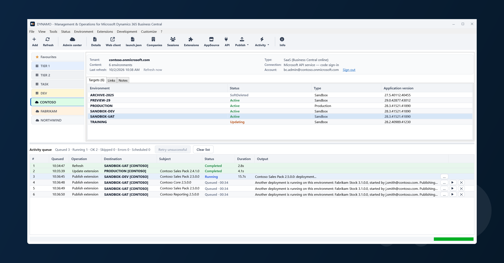

*English · [Italiano](README.it.md)*

Administration console for **Microsoft Dynamics 365 Business Central**, on premises and online,
from one window.

Every tab is a **server** (on premises) or a **tenant** (online); the rows are the service
**instances** or the **environments**. From there you check that a target is reachable, start and
stop services, publish and manage extensions, read and compare service configurations, see who is
connected, and open the web client on the company you want — across many targets at once, with the
outcome of every operation kept in a queue you can read at your own pace.

**[Download the latest version](../../releases/latest)** · [Changelog](CHANGELOG.md) ·
[License](LICENSE) · [Usage data](PRIVACY.txt)

| | On premises | Online |
|---|---|---|
| Readiness test | ✔ | ✔ |
| Start / Stop / Restart | ✔ | — (there is no service to start) |
| License information and loading | ✔ | — (licenses are M365 subscriptions) |
| List of installed extensions | ✔ | ✔ |
| Install / uninstall / unpublish an extension | ✔ | ✔ (unpublish needs BC 25.4+) |
| Extension schema synchronization | ✔ | — (the platform does it during the deployment) |
| Publishing (single .app or whole folder) | ✔ | ✔ |
| Reading and changing the service configuration | ✔ | — (no API exposes it) |
| Environment operations (copy, restore, update window) | — | ✔ |
| Scheduled operations (update window, next update) | — | ✔ |
| AppSource catalog (install and update marketplace apps) | — | ✔ |
| Local history of the operations started from this computer | ✔ | ✔ |

*On premises — the instances of a server, with the activity queue below.*

*Online — the environments of a tenant, in the same window and the same queue.*

---

## Why Dynamo

Anyone who has ridden a bicycle with a dynamo remembers it: that small cylinder
resting against the side of the wheel, spinning as you pedal and lighting the
lamp. No battery, no external power. Just movement turning into light.

Dynamo does the same for Business Central. The instances are already there, so
are the services and the tenants — but until someone starts them, configures
them and keeps an eye on them, they stay dark. Dynamo is the part that turns an
administrator's work into a live, running environment.

That is where the logo comes from too. The word starts in the neutral white of
**DYNA** and lights up on the orange of **MO**:
the same arc as the metaphor, from movement to light. And those two letters are
not there by chance — MO stands for Management & Operations, which is exactly
what the product does.

## Download and install

Two installer packages are published with every release. They differ **only in the language of the
setup windows** — the installed application is the same and is bilingual either way:

    dynamo-<version>-x64-en.msi    setup in English
    dynamo-<version>-x64-it.msi    setup in Italian

Double click the file. Setup shows the license agreement and asks you to accept it, then asks three
things: the destination **folder** (`C:\Program Files\Dynamo` by default), which **shortcuts** to
create, and the default **language**. The installation is per machine, so the shortcuts appear for
every user and administrator rights are required.

Prefer a short destination path: the file tree already reaches 102 characters on its own, and past
260 in total Windows can no longer write.

The package is **not signed**: Windows shows "Unknown publisher" on the elevation prompt.

### Upgrading and uninstalling

To upgrade, run the installer of the new version: the previous one is removed and replaced in one
go, with nothing to uninstall first and no old files left behind. To uninstall: *Windows Settings >
Apps > Installed apps > DYNAMO*.

Running the installer of the version already installed, or choosing *Modify* next to the entry in
Installed apps, opens the maintenance page with the three usual choices — **Change** (shortcuts and
default language), **Repair** (puts back missing or damaged files) and **Remove**.

Neither upgrading nor uninstalling loses your list, tabs, online connections or preferences: they
live in your user profile and are not touched. To remove those as well, delete the folder by hand.

### Checking for updates

DYNAMO can check on its own whether a newer version has been published here, and offer to
download and install it. The check alone never installs anything — downloading and installing
always need an explicit click — and it changes only the label of *? > Check for updates*, to
*Update available: version …*. Opening that shows what changed and, on request, downloads the
installer for your language, verifies it against the checksum published with it, and starts it;
DYNAMO closes so it can replace the files in use, exactly as if you had run the new installer by
hand.

Whether it checks is set in *Settings > Updates*, "Automatically check for updates" — on by
default, checked at every startup. Turning it off leaves only the on-demand check, the right
choice on a server where outbound connections are restricted by policy.

---

## Requirements

**On the PC running the tool** — nothing to install: the .NET runtime is included in the package.
Windows 10/11, or Windows Server 2016 or later, x64. The program starts with your own rights and
does **not** ask for UAC. Administrator rights are needed only for Business Central instances
installed on that same computer; where they are needed and you do not have them the commands stay
switched off and the status bar says so, so nothing fails halfway through. *Tools > Restart as
administrator* restarts the program with the rights. Working on remote servers or online never
needs any of this.

**On the on-premises Business Central servers** — Windows PowerShell 5.1 with the Business Central
administration module installed; PowerShell Remoting (WinRM) enabled, with the loopback allowed for
services on the same machine; an account permitted to manage the services and publish extensions.
The standard WinRM port is used; a server that only accepts HTTPS is set up per tab, under
*Connection settings*.

**For online environments** — connectivity to `api.businesscentral.dynamics.com` and
`login.microsoftonline.com`; a browser to sign in with; a Business Central administrator account on
the tenant. With the default sign-in mode there is nothing to prepare in Azure.

---

## First run — building the list

The list starts **empty**. If Business Central is installed on the computer itself, though, it
starts with the **localhost** tab and the instances found, and on every start that tab realigns
itself with the installed ones.

Tabs are created from *Tools > Add tab*, or from the first toolbar button: you type the label and
choose the type.

- **On premises**: give the server name and the Business Central services installed on it are
  discovered and added to the tab. The tab stays even when nothing is found: the server may simply
  be off.
- **Online**: give the tenant domain (`contoso.onmicrosoft.com`) or its identifier, and the
  environments are listed after you sign in.
- **None**: a tab with no targets, made of links and notes only.

The list saves itself on every change. It can be **exported and imported**, in full or one tab at a
time, so a colleague can start from a single server or tenant of yours without retyping anything —
your own preferences are never carried along with it. Exporting lets you choose, per transfer,
whether to include the tab's links (on by default) and its notes (off by default, since a note may
hold something you would not want to hand over without thinking about it first).

### Signing in to a tenant

Two ways, neither of which keeps a secret on the machine:

- **Code sign-in — the default.** The program shows a code; you type it in the browser at the
  address shown, even from another device, and sign in with your company account, MFA included. The
  operation then resumes on its own. **It needs no preparation in Azure**: a tenant you have just
  added works straight away.
- **Direct sign-in through an app registration.** The browser opens immediately and the sign-in
  completes with no code to type. This one needs an application registration in Microsoft Entra ID,
  done once per organisation by a tenant administrator: a registration of type *public
  client/native* with `http://localhost` as the redirect URI, the delegated permission
  *user_impersonation* on Dynamics 365 Business Central, admin consent granted, and public client
  flows allowed. Then paste the application (client) ID into the connection dialog — it is the only
  value to enter.

No client secret is needed in either case. The settings are **per tenant**, so different customers
can have different registrations and even different clouds, and the sign-in token is kept in an
encrypted cache in your own Windows profile.

---

## What you can do

### Services and status

*Check status* is a **read-only** test: it reports, target by target, whether the service is
reachable and whether the account is allowed to work on it. Use it first — it changes nothing.

*Start*, *Stop* and *Restart* act on every highlighted row; *Restart* skips what is not running.
They are disabled on online tabs, where there is no service to command.

### The target

- **Details card** — everything the target declares about itself: type, status, version, and for
  online environments the next update, the country, region and geography, the database size and the
  web addresses, selectable so they can be copied. For an on-premises instance, the server, the
  instance, the Windows service name and the administration module path actually used, which is the
  first thing to look at when the module fails to load. Values Business Central does not provide
  stay empty rather than being guessed. Next to the Business Central version, **What's new in …**
  opens the page Microsoft publishes for that update — and the same next to the version an
  environment is about to move to, so the news can be read *before* updating. The link appears only
  where the page exists.
  The card also tells how the target is doing right now: how many sessions are open and, for an
  online environment, which extensions are being deployed to it. Both can be clicked and open the
  full list or the event log. If a value cannot be read the row says *not available* and why: it
  never shows zero.
- **Open web client** — opens the environment or the instance in your default browser, on the
  company you choose, so the Business Central company selection does not appear. The company you
  picked last on that target comes back selected, at the top of the list with a star; with a single
  company it opens straight away. On
  a server the question comes only where the service does not already declare a default company.
- **Configuration for VS Code** — produces the configuration to paste into `launch.json` to develop
  against that target, with the values read from the service. From *Active sessions* you also get
  the attach configuration for the highlighted session, ready to use.
- **Company list** — name, display name and identifier of the companies, copyable.
- **Active sessions** — who is connected, and the ability to end a session.
- **License information** — reads the Business Central license of an on-premises instance, and
  loads a new one.

### Extensions

**Extension management** reads the extensions of the current target and shows them with name,
publisher, version, state, how they were published and their identifier. It sorts by column and
filters on three axes that combine: state, publisher and free text. From there you synchronize,
install, uninstall and unpublish. On premises you also run the **data upgrade** of a new version
already published, on the extensions that need it — synchronizing it first when required.

Uninstalling **never deletes data**, on any target type: the command that would erase an
extension's tables is not reachable from here. On online environments the confirmation first tells
you what depends on the extension and must go first, and whether a version is already scheduled —
which matters, because uninstalling does not remove a scheduled version and the extension would
reinstall itself later on its own. An uninstall is always asked for now; the environment can still
postpone it to its own update, and when it does the queue row ends **Scheduled** and says so.

Only on premises there are the **Sync** and **Data upgrade** columns: an extension published but not
synchronized does not work, and that is not visible anywhere else; the second marks the version
waiting for its data upgrade — also when it is the data that is behind the package, which the **Data
version** column shows: the version the extension's data is at on the tenant.

**Publishing** takes a single `.app` or a whole folder, and works out the order from the
dependencies declared inside each package. The order is shown before you confirm and **can be
changed** — moving an app before one it depends on warns you but does not stop you, because that
dependency may already be installed. Each app gets its own row in the queue, with state, duration
and error, so you can leave the desk and see on your return what went through. If one app fails the
others go on; only those that depended on it are skipped, because they would fail anyway.

Online the installation can also wait for the environment's **update window**, or for its next minor
or major update. An environment with no update window refuses the first choice, and nothing is sent
to it.

On premises, when Business Central requires a data upgrade for the new version — even when the
previous one is uninstalled but its data is still there — the publish runs it and installs the
extension. You can untick it in the dialog: the package is then published and synchronized, and you
run the upgrade later from Extension Management.

**Compare extensions** puts the extensions of two targets side by side — even targets of different
kinds, on different tabs — and shows what differs.

**Linked apps** answers the question you ask before removing anything: what breaks if this
extension goes away.

### Online environments

Create, copy, rename and delete an environment; restore it to a point in time or from the recycle
bin; set the update window and schedule the update; and read the environment's event log — creation,
copy, rename, deletion, updates, app installations. The log tells the whole story, not only what went
through the administration center: deployments made from Visual Studio Code and from inside Business
Central are listed too, in date order, and a **Source** column says where each row comes from — those
recorded by Business Central do not say who started them, when they ended or why they failed.

**Scheduled operations** lists what will run later on its own — per-tenant extensions waiting for
the update window or the next update, app updates sent to the window, the next environment update —
and cancels what Business Central allows to be cancelled.

**App updates** live inside extension management: the *Available version* column carries the version
you can move to, and the *Status* column says **Update available**, in amber, instead of
*Installed*, so sorting by status groups the apps to update. You update either straight away or in
the environment's update window. Apps
that have to be updated first are queued too, and before it: the confirmation lists the whole chain
in the order it will happen. This covers apps installed from the marketplace, partner apps included;
per-tenant extensions have no available version here — they are updated by publishing the new
package. When a new version of a per-tenant extension is already scheduled, its row says **Update
scheduled**, shows that version, and **Cancel scheduling** removes it.

**AppSource catalog** opens already full: every Business Central app published for the market of the
highlighted environment, alphabetical, filtered by typing part of the app name or the publisher's —
with one click on Microsoft or on the publishers the environment already has apps from. Each row
says who publishes it, the version installed, the version available — what would arrive if you
pressed the button — and whether the app is installed, not installed or to be updated. For the
highlighted app you read what the marketplace says about it: what it does, how it is priced, its
rating, its categories and the links to license terms, privacy policy and support; a double click
opens the publisher's page. The window says how many apps there are, for which market and when the
list was read, and *Refresh list* reads it again. Apps whose publisher asks to be contacted first stay
in the list, but cannot be installed from here.

**Install** asks for a confirmation that names the extension and the environment, shows the
publisher's terms and privacy policy, and stays off until you tick that you accept them. Installing
is not buying: the license stays a matter between the customer and the publisher. On an app that
already has an update the same button becomes **Update**, and goes to the version *the environment*
offers, which can be behind the latest one published. Both go through the activity queue like any
other extension operation, and can wait for the environment's update window.

### Service configuration (on premises)

All the configuration keys of an instance, grouped by area and with the description of what each one
does. Two instances can be **compared**, showing only the keys that differ — the fastest way to find
out why one server behaves unlike another. A key can be changed from here, behind a confirmation
that names the instance.

### Tab links

Next to the targets tab, every tab has one with its **links**: the description and address of a
website, a local folder or a network share. They keep next to the target the things that belong to it — the
customer's portal, the documentation, the folder with the packages. They are added, edited,
reordered and opened on a double click; they travel with the exported list unless left out at export
time (see "First run — building the list" above), so whoever receives it gets them too. A link that
points to a program or a script asks for confirmation before running it, naming the file.

Links can be gathered into **groups**, created from the same *Add* button, so a tab with twenty
entries stays readable. A link goes into a group by dragging it onto it or from the right-click menu,
a group opens and closes on its triangle, and deleting a group does not delete the links it holds.
Groups travel with the exported list too.

### Tab notes

A third tab, **Notes**, holds free text about the tab: an appointment to respect, a contact, anything
that does not fit a link. A note is added, edited, deleted and reordered with "Add" and Up/Down, and
it can be marked **Important** — it then shows in red in its card and, when the tab has at least one
important note, also in a banner above the targets grid, two lines at most with an ellipsis if there
is more than fits; clicking the banner takes you straight to the Notes tab. Notes can hold personal
or confidential information about the target, so — unlike links — **they do not travel with the
exported list unless you ask**: see "First run — building the list" above.

### Development

**Download Microsoft symbols** fetches Microsoft's AL symbol packages from the public feeds, with no
target and no sign-in: you choose the localization and the Business Central version, and you get the
base set — System, System Application, Business Foundation, Base Application, Application — plus
the other Microsoft apps you tick.

**Download symbols**, in extension management, fetches the symbols of the highlighted extension at
the version installed on that target and, on request, its dependencies. They come either from the
public feeds, for Microsoft and AppSource apps, or **straight from the target** through its
development services, as VS Code does — per-tenant extensions included; online this works on
sandboxes, not on Production environments.

**Web services and APIs** shows what a target publishes to the outside, and only reads: every
service with the protocol it answers on — OData V4, API, SOAP — and the address it is called at,
already filled in with the company. For each service, its fields with type, length and key, and its
methods with the parameters in the order they must be passed and the returned value; on SOAP
services the parameters the procedure modifies are marked as such. Three more tabs — **Payload**,
**Response** and **Error** — hold the examples a technical document needs: what you send, what comes
back and what an error looks like, ready to paste into the document or into Postman. The APIs that
installed apps publish on an address of their own are shown too, and every list copies whole, with
its column headings, into a spreadsheet.

---

## The activity queue

The grid at the bottom is a **basket**: operations do not start straight away, they are queued, and
more can be added while the queue is running. Nothing wipes the results of the previous operation.

There is one rule: **one lane per target**. Inside a lane the activities run in sequence, in the
order you asked for them; different lanes run in parallel. Ask for "extension X on A", "extension X
on B", "extension Y on A" and finally "restart A", and X on A and X on B start together, Y on A
starts when X on A has finished, and the restart of A comes after Y — without waiting for B, which
is on another lane.

*Max targets in parallel* limits the lanes, so it applies to the whole queue, and it can be changed
with the queue full: raising it starts the waiting targets immediately, lowering it interrupts
nothing already started.

The **x** at the end of a row appears only on rows still queued, and removes that row only: a job
already running is not interrupted, because stopping a publish halfway would leave the service in an
uncertain state. Closing the application with a full queue asks for confirmation — and the
interruption stops the application, not what the server has already started.

### Reading the results

The status text is coloured: green completed, red error, amber skipped, blue running, purple
scheduled. **Scheduled** is for what the environment accepted but has not run yet — a publish sent
to the update window or to a future version — as opposed to *Skipped*, which will not happen. A
truncated error opens in full with the **...** button, and the message at the bottom of the window
opens in a readable window when you click it.

When a publish to an online environment fails, the reason written by Business Central is reported
**in the job**, with the time and the identifier of the operation, so there is nothing else to open.
Two cases have no reason to report — a package over 50 MB, and an environment that cannot report it
yet — and the job says so instead of leaving you guessing.

*Check status* produces an itemised report: one row per check, with outcome and cause, failed rows
highlighted.

### Waiting until the target is ready

Before an operation on an extension — publish, install, uninstall, unpublish, synchronize, data
upgrade, update — DYNAMO checks three things: that the online environment is not being prepared,
updated or removed; that no other deployment is already running on it, even one started by a
colleague, from VS Code or from inside Business Central; and, on a server, that the instance service
is running. If something is off, the row stays *Queued* with the reason and the seconds left before
the next check, and the operation starts on its own as soon as the way is clear. Work on the other
targets keeps starting meanwhile. Starting, stopping and restarting services are never held back.

*Waiting for the environment — the reason names the extension already being deployed and who started it.*

The reason says **what** is in the way: the extension and version being deployed on the environment,
and **who started it** — the account, when the Admin Center records it. A deployment started from VS
Code or from inside Business Central has no author on record, and the row says "not recorded"
rather than guess. A publish of a whole folder waits as a single operation: every app shows the same
reason and the same countdown, and they start in the confirmed order as soon as the way is clear.
Each wait is also kept in the local history, with how many times the check was repeated (see *Local
history*).

After half an hour of waiting the row ends *Skipped*, with the reason written, and nothing has been
touched. A deployment that Business Central left hanging — it never closes an interrupted one — stops
being waited for after four hours; the limit is set in *Tools > Settings > Execution*, "Stop waiting
for a deployment after (hours)", and with 0 it is always waited for.

When it is the wrong row that is waiting, **Start now**, the button at the end of the row, skips the
wait. The confirmation names the target and repeats the reason, because if the target is really busy
Business Central can refuse the operation.

### Retrying a row

A row that did not do its job can be retried from the queue, and it starts again with the options it
started with — sync mode, unpublish previous versions, delete the files afterwards, data removal —
without going back through the menu. The button shows on rows in error and on rows *Skipped* because
the wait expired; the other skips, such as a version already there or a missing dependency, would
only give the same skip again. **Retry unsuccessful**, above the list, puts them all back at once.
The failed row stays in the list: the new attempt is a new row.

Operations that can lose data or interrupt a service ask for confirmation again, naming the target
and the options they restart with. Creating, copying, renaming, deleting and restoring an online
environment are never retried: they keep running on Microsoft's servers even when DYNAMO loses track
of them, and doing them again blindly could create a second environment or act on the wrong one.

---

## Local history

*Activity > Local history* is the record of the maintenance done **from this computer**. Only what
changes an instance or an environment goes in — start, stop and restart, publishing, installing,
uninstalling, synchronizing, data upgrades, license import, configuration changes, ending a session,
and creating, copying, renaming, deleting and restoring environments. Looking at a list changes
nothing, so it does not appear.

Every entry carries date and time, user, server or tenant, instance or environment, operation,
subject and outcome — *Succeeded*, *Error*, *Skipped*, *Scheduled*, *Cancelled*. The box at the
bottom shows the steps of the highlighted row — for a publish, each command run on Business Central
— the options chosen in the window before it, and the full error message. The window opens on the
highlighted target, and a drop-down widens it to the whole tab or to the whole record; columns sort
on a click, and the list narrows by text, outcome and month.

It is not the environment's event log: that is what Business Central recorded on the environment,
this is what you did from here. It stays on this machine and is never sent anywhere. One file per
month, the last twelve are kept, and *Tools > Settings > Local history* turns it off. The value of a
configuration key with "Password" or "Secret" in its name is never recorded.

---

## Selection and confirmations

Rows are chosen with the **standard Windows selection**: click, Ctrl+click to add or remove,
Shift+click for a range, Ctrl+A for all. There are no menu entries for selection — the grid does it,
as in any other Windows list. The selection of each tab survives a tab change.

Two notions matter: the **highlighted rows**, on which the commands that accept several targets act,
and the **current row**, the last one you clicked, on which the commands that accept only one act.
With a single highlighted row the two coincide, which is the normal case.

Every function acting on several rows asks for **confirmation, saying how many and which targets
will be touched**. Confirmations that would interrupt a service start on "No".

Clicking a column header sorts the grid, and an **arrow** next to the title says which column is in
charge and in which direction — up for ascending, down for descending. The activity queue is the
exception: it cannot be sorted, and always stays in the order the rows were queued.

---

## Where the settings live

| | |
|---|---|
| List, tabs and online connections | `%APPDATA%\Dynamo\environments.json` |
| Preferences (language, parallelism, refresh) | `%APPDATA%\Dynamo\settings.json` |
| Sign-in token cache (encrypted) | `%LOCALAPPDATA%\Dynamo\` |
| On-premises server accounts | Windows Credential Manager, `DYNAMO:<server>` |
| Unexpected error details (most recent kept) | `%APPDATA%\Dynamo\errors.log` |
| Maintenance record for instances and environments (one file per month, last twelve) | `%APPDATA%\Dynamo\history\` |

*Tools > Settings* shows the path of the folder and opens it: that is the folder to copy for a
backup, or to move the configuration to another machine.

They are **two files on purpose**. The list is exported and shared; the preferences belong to
whoever uses the machine — so importing a colleague's list does not take your own configuration
away.

---

## Language and regional settings

The application speaks **English or Italian**, chosen in *Tools > Settings*. The first run starts from
the Windows language and writes it into the configuration; from then on your choice rules, not the
machine. On a Windows that is neither, it starts in English. The change takes effect at the next
start — windows already built do not rewrite themselves — and the dialog says so when you confirm.

Numbers and dates follow the **chosen language**, not the Windows one: a duration reads `8.4s` in
English and `8,4s` in Italian.

Messages coming from Business Central, from PowerShell or from Windows stay in the language of
whoever produced them and are not translated: rewriting them would mean inventing them.

---

## Security and careful use

The tool acts on production systems, and it is built to make that safe rather than fast.

- **The commands it can run are a fixed, closed set.** Nothing arbitrary can be executed through it,
  and every value it passes to Business Central travels as a parameter, never as text glued into a
  command. The exact list of the commands used is written out in the guide included in the package,
  where it serves as a guarantee of what the program really runs.
- **Every destructive operation is confirmed by name.** The confirmation says which targets are
  about to be touched, and the ones that would interrupt a service start on "No".
- **The read-only test changes nothing.** Use it first to check connectivity and permissions.
- **Sign-in to online tenants is interactive**, against Microsoft Entra ID with a public client:
  no secret is stored on the machine. The token stays in an encrypted cache in your own Windows
  profile.
- **On-premises server accounts live in the Windows Credential Manager**, where you can see and
  remove them from the Control Panel without going through the application. The "Remember the
  password" box starts **unticked**: saving the password of a production administrator has to be a
  choice, not a default.

Read these before you act on a production system:

- **Stopping or restarting a production instance interrupts the service** — users disconnected,
  running operations aborted. Do it in a maintenance window.
- **Publishing an extension changes the target.** Try it on a test instance or a sandbox
  environment first, never straight in production.
- **On premises, the ForceSync mode uninstalls and republishes a version already present**, and
  applies schema changes even when they cause data loss. A second explicit confirmation is asked
  for.
- **Online, the Force Sync schema mode allows destructive schema changes**: the data of the tables
  that are modified or removed can be lost irreversibly. A second explicit confirmation is asked
  for.

---

## Usage data

DYNAMO can send **anonymous usage counts**, so that which commands are actually used, and on which
Business Central versions, can decide what gets improved. Names of servers, instances, tenants,
databases, accounts, companies and extensions never leave the machine, nor do paths or the text of
error messages.

It is switched off in *Settings > Privacy*, and takes effect immediately. What is waiting to be sent
sits in a plain-text file in your user profile that you can read with Notepad and delete at any
time.

The full notice is in **[PRIVACY.txt](PRIVACY.txt)**, and on that same page inside the program.

---

## License

Proprietary software, all rights reserved. The end user license agreement is in
**[LICENSE](LICENSE)** ([Italian version](LICENSE.it)). By installing or using the program you
accept its terms.

The application includes third-party components: their notices are in
**[THIRD-PARTY-NOTICES.txt](THIRD-PARTY-NOTICES.txt)** and are shown in the application under
*About > Third-party components*.

> Microsoft, Dynamics and Business Central are registered trademarks of Microsoft Corporation.
> DYNAMO is not affiliated with or sponsored by Microsoft.

---

## Reporting a problem

Open an [issue](../../issues). For anything that looks like a security problem, please read
[SECURITY.md](SECURITY.md) first.

When reporting, never paste server names, instance names, tenant identifiers, user names or
credentials: an issue is public. The version number, what you did and what happened are enough to
start.

---

## Support the project

As a passionate Business Central developer, I dedicate my free time to creating tools that make AL development smoother, faster, and more enjoyable. 
My goal is to simplify workflows, introduce practical features, and enhance the daily experience of developers like you.

If my tools have saved you time, boosted your productivity, or simply made your work easier, I'd greatly appreciate your support. 
By "buying me a coffee," you enable me to continue improving and maintaining these tools, ensuring they remain valuable and up-to-date.

Every contribution, big or small, helps me focus on innovation and delivering even better solutions for the AL development community. 
Your support truly makes a difference and keeps this journey alive

